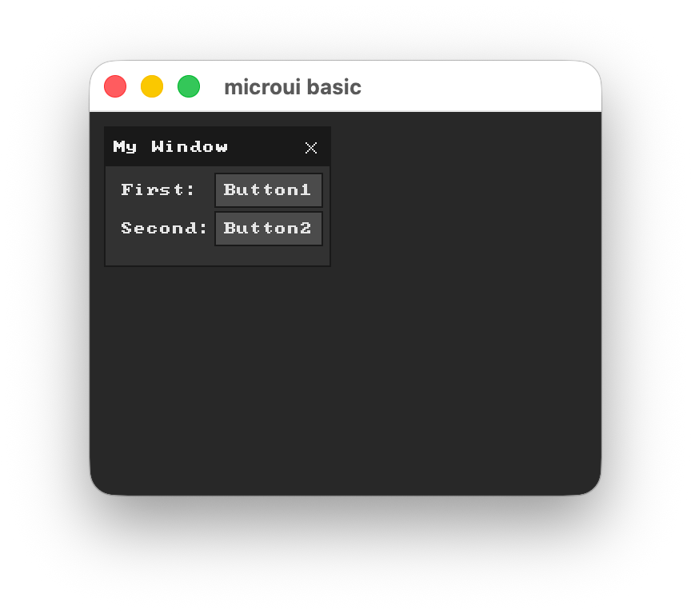

# microui-rs

A Rust port of [microui](https://github.com/rxi/microui) v2.02 by rxi — a tiny, immediate-mode UI library that works with any renderer that can draw rectangles and text.

The public API is a 1:1 match to the original C API, including the `mu_` prefix on every function and constant.

## Why This Fork

If you want the closest Rust equivalent of upstream `microui`, this fork is the stronger choice:

- Compared to [NeoCogi/microui-rs](https://github.com/NeoCogi/microui-rs), this crate stays closer to the original C surface: same `mu_*` names, same constants, same immediate-mode flow, no library dependencies, and parity tests against the bundled upstream sources.
- Compared to [NeoCogi/microui-redux](https://github.com/NeoCogi/microui-redux), this crate remains a small immediate-mode port instead of growing into a larger retained-mode UI toolkit with a different authoring model.
- In short: this fork is superior if your goal is exact upstream behavior, a minimal dependency footprint, and a direct C-to-Rust port rather than a Rust-first redesign.

## Features

- Fixed-size memory: no heap allocation inside the library
- Built-in controls: window, panel, button, slider, textbox, label, checkbox, word-wrapped text
- Renderer-agnostic: you handle drawing commands, the library produces them
- C API parity: same function names, same argument types, same constants as the original

## Usage

```rust
use microui::*;

let mut ctx = Context::new();
ctx.text_width  = Some(|_font, text, len| { /* measure text */ 0 });
ctx.text_height = Some(|_font| 12);

// each frame:
mu_begin(&mut ctx);

if mu_begin_window(&mut ctx, "My Window", mu_rect(10, 10, 140, 86)) != 0 {
    mu_layout_row(&mut ctx, 2, Some(&[60, -1]), 0);

    mu_label(&mut ctx, "First:");
    if mu_button(&mut ctx, "Button1") != 0 {
        println!("Button1 pressed");
    }

    mu_label(&mut ctx, "Second:");
    if mu_button(&mut ctx, "Button2") != 0 {
        mu_open_popup(&mut ctx, "My Popup");
    }

    if mu_begin_popup(&mut ctx, "My Popup") != 0 {
        mu_label(&mut ctx, "Hello world!");
        mu_end_popup(&mut ctx);
    }

    mu_end_window(&mut ctx);
}

mu_end(&mut ctx);

// consume draw commands:
let mut cursor = None;
while let Some(cmd) = mu_next_command(&ctx, &mut cursor) {
    match cmd {
        Command::Rect(c)  => { /* draw filled rect */ }
        Command::Text(c)  => { /* draw text */ }
        Command::Icon(c)  => { /* draw icon */ }
        Command::Clip(c)  => { /* set clip rect */ }
        Command::Jump(_)  => {}
    }
}
```

## Screenshot



## Running the example

The `examples/basic` subcrate shows a working interactive window using [winit](https://github.com/rust-windowing/winit) + [softbuffer](https://github.com/rust-windowing/softbuffer) with a software renderer and 8x8 bitmap font.

```sh
cargo run -p microui-basic
```

## Tests

```sh
# library tests
cargo test -p microui

# pixel snapshot test (no window required — compares raw RGBA output to a golden file)
cargo test -p microui-basic

# regenerate the golden file after an intentional visual change
BLESS=1 cargo test -p microui-basic
```

## Notes

- The library does not draw anything itself. Feed it input, read back commands, render them.
- The original C source and header are kept in `src/` for reference.

## License

MIT — see [LICENSE](LICENSE).
